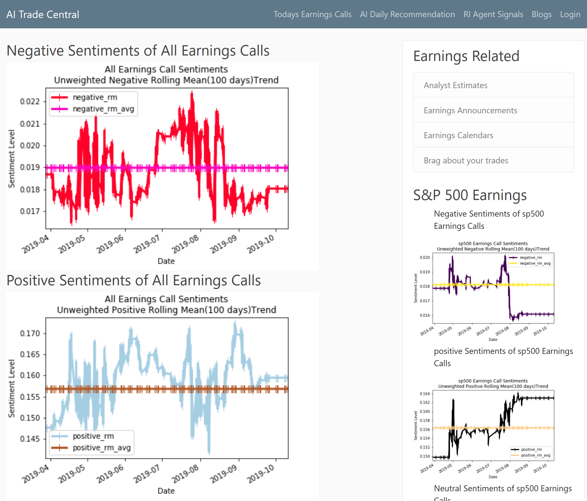
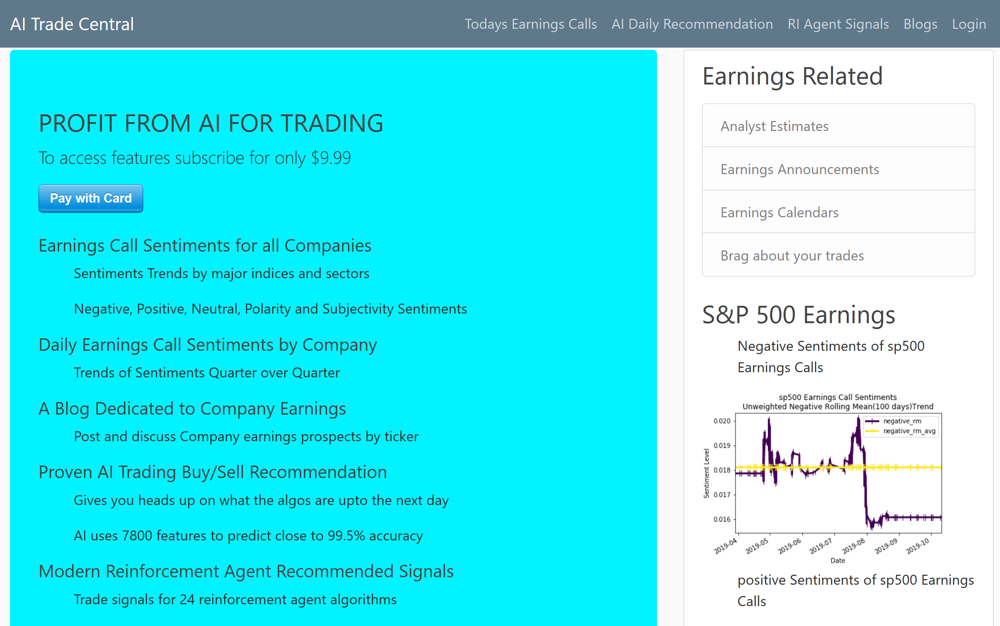
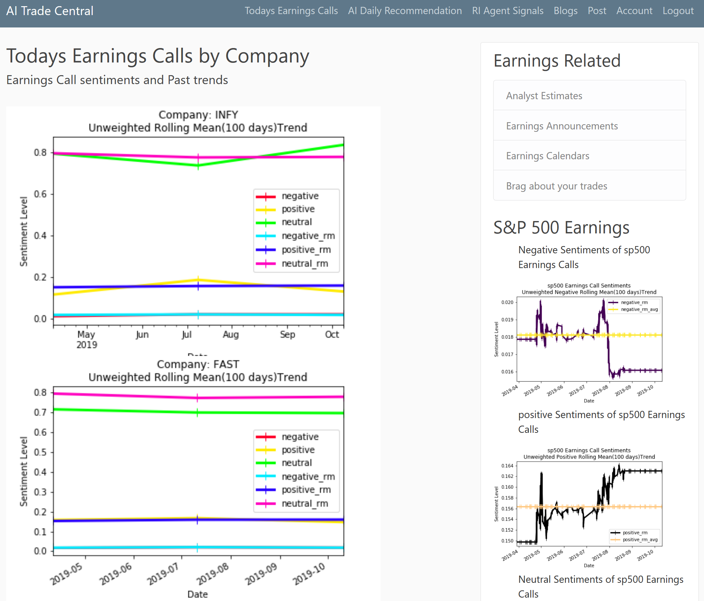
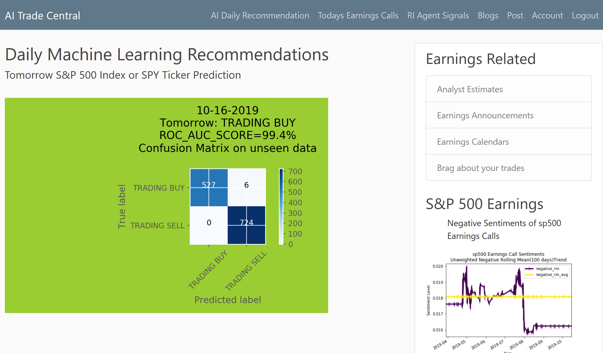
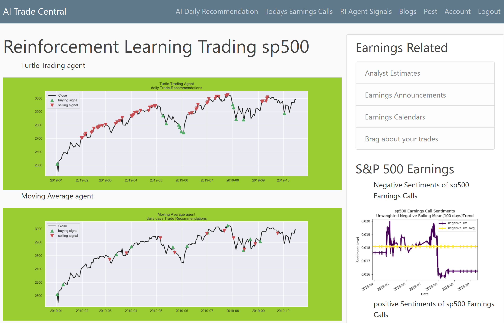
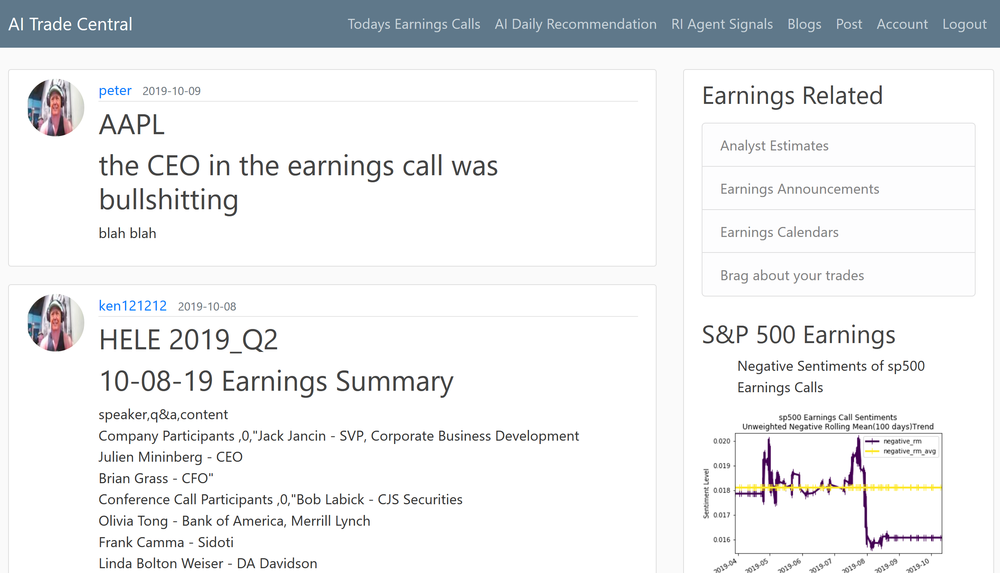
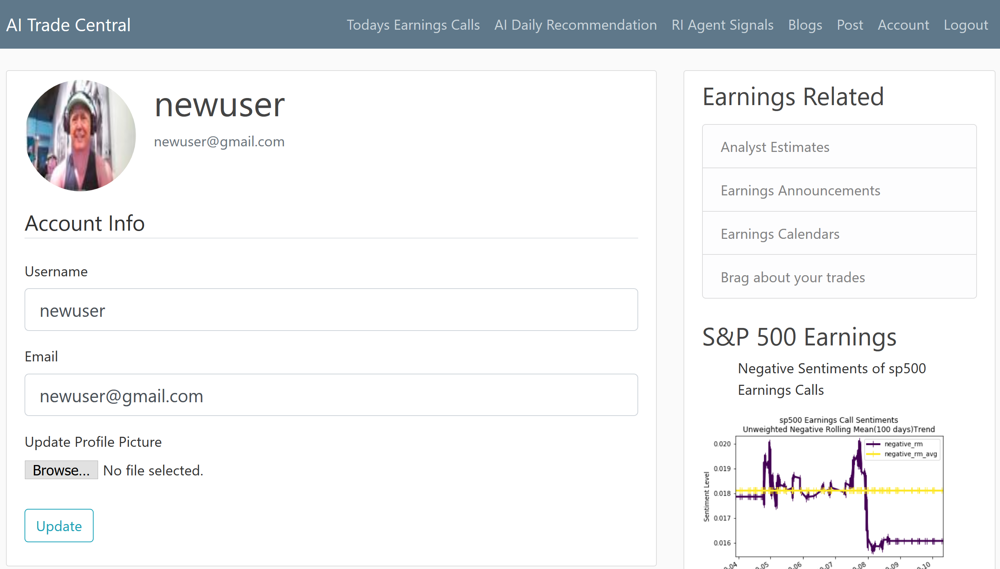
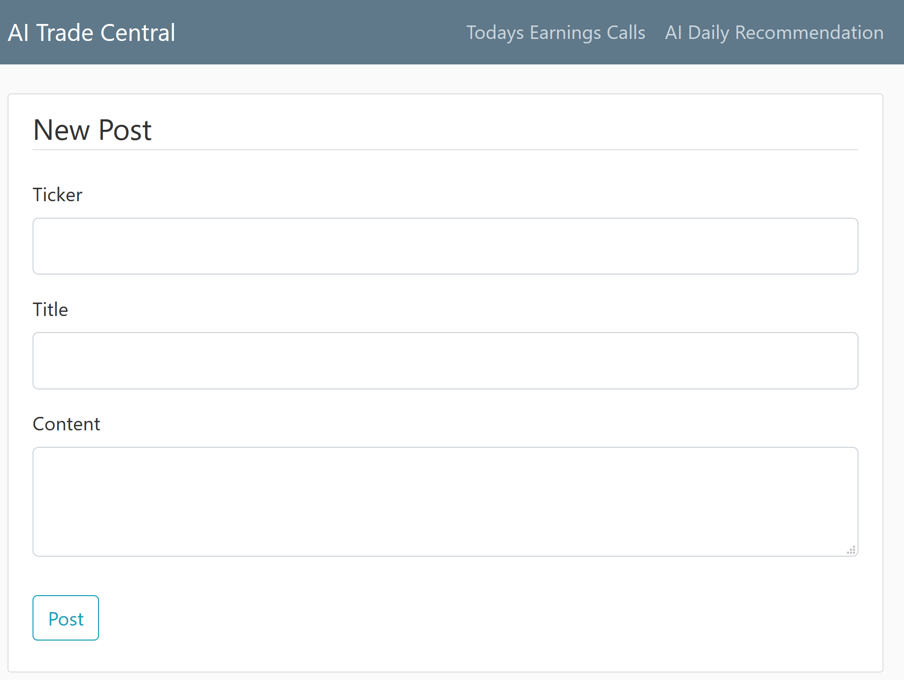
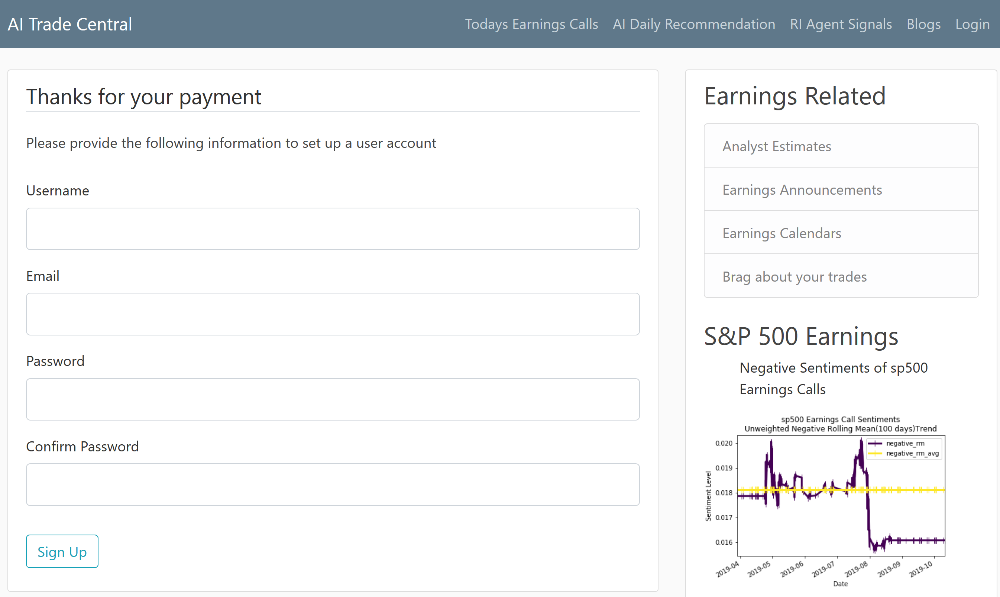
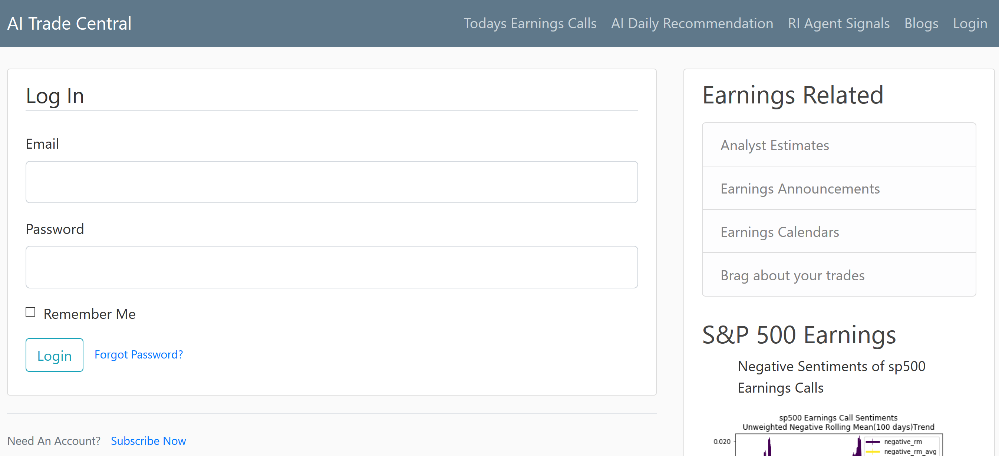

# Make Profit by Trading using AI
Help Traders Make Money Daily and Before & after earnings release/call

### Indices, Sectors Sentiments
    -trade indices and sectors based on current sentiment trends of companies in the sector or indices
### Daily Earnings call release sentiments by ticker and its past trends
    -trade individual companies before and after earnings release using the trends of sentiments
## Daily propritary AI Trading Buy/Sell recommendation(using 7800 features & accuracy 99.5%)
    -get aheads up on what the algos are upto the next day. Use this knowledge to place profitable trades ahead
## 24 Reinforcement Learning Agent Trading Signals
    -Use 24 reinforcemnt agent trade signals to make profitable trade decisions
## Blogging by ticker
    -blog your views on earnings prospects of a company and read what others have to say about company prospects
## Charts for 52 technicals for company announcing earnings(added later)
## payment using stripe
## upload of image of the user
## User authentication
## Password retrieval
## Remember login 

